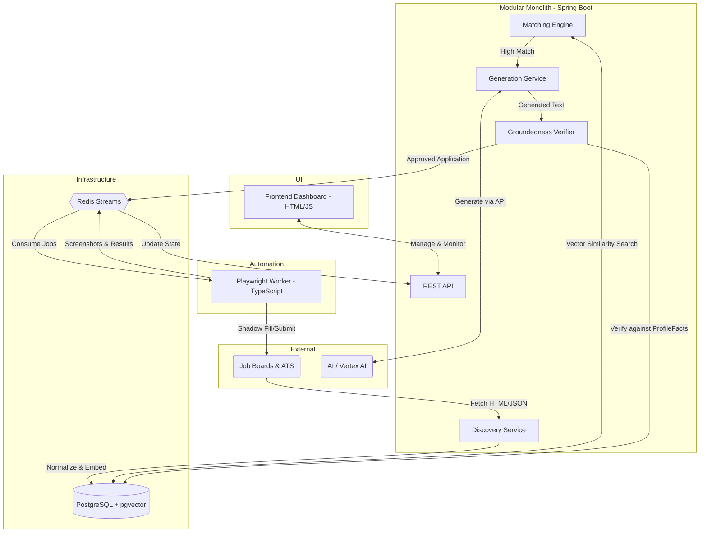
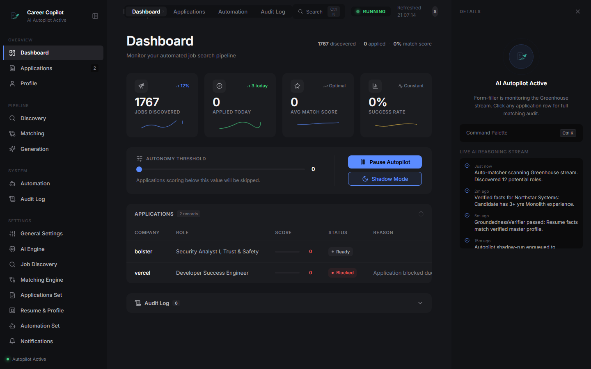

# AI Career Copilot

An autonomous job application system that discovers jobs, matches candidate profiles using vector search, generates fact-grounded resumes, and automates form-filling with production-grade safety guardrails.


**[🚀 Live Demo (Dashboard)](https://sailen-mondal.github.io/career-copilot/)** — runs with built-in mock data, no backend required

## Overview

AI Career Copilot was engineered to automate the tedious and time-consuming process of modern job hunting while maintaining absolute control over the quality and truthfulness of applications. It ingests job listings from multiple ATS platforms and job boards, evaluates them against a candidate's verified profile facts, and employs advanced vector similarity search to score the matches. 

Instead of relying on standard templated resumes, the system dynamically generates highly tailored cover letters and resumes using Large Language Models (LLMs). To ensure complete accuracy, every generated claim is rigorously verified against a predefined set of immutable profile facts, preventing AI hallucinations from leaking into professional applications. 

The application workflow is completely decoupled from the main backend using Redis Streams, allowing a scalable TypeScript/Playwright worker pool to handle the browser automation. Safety is a first-class citizen, featuring configurable autonomy tiers, shadow-mode execution, and a circuit breaker pattern to instantly halt operations if automation encounters persistent errors.

## Architecture



## Key Features

- **Multi-Source Job Discovery**: Ingests, normalizes, and deduplicates listings from Greenhouse, Lever, Remotive, Arbeitnow, and Himalayas.
- **Hybrid Matching Engine**: Combines hard pre-filters (visa, location, seniority) with `pgvector` embedding similarity for highly accurate candidate-role matching.
- **Fact-Grounded Generation**: Dynamically tailors resumes and cover letters using LLMs, embedding unique `[fact:UUID]` markers to trace every claim.
- **Anti-Hallucination Guardrails**: A strict `GroundednessVerifier` cross-references all generated text against immutable profile facts, blocking untruthful applications.
- **Asynchronous Automation Worker**: Offloads heavy browser interactions to a scalable TypeScript/Playwright worker via Redis Streams.
- **Shadow Mode Execution**: Safely validates automation scripts by filling out forms and taking screenshots without actually clicking the final submit button.
- **Circuit Breaker & Kill Switch**: Automatically trips after consecutive worker failures and provides a global, instantaneous halt mechanism via in-memory and Redis flags.
- **Dark-Mode Productivity Dashboard**: A sleek, real-time control center with command palette support, live polling, and workflow visualizations.
- **Configurable Autonomy Policies**: Fine-grained control over match score thresholds and application velocity to comply with daily rate limits per platform.

## Tech Stack

| Layer | Technology |
|---|---|
| **Language** | Java 21 (LTS) |
| **Backend Framework** | Spring Boot 3.4 (Web, Data JPA, Security, Actuator) |
| **AI / LLM** | Spring AI, Vertex AI Gemini 2.0 Flash, OpenRouter |
| **Database** | PostgreSQL 17 + pgvector (vector similarity) |
| **Migrations & ORM** | Flyway, Hibernate 6 + hibernate-vector |
| **Message Queue** | Redis Streams |
| **Browser Automation**| Playwright (TypeScript), pdf-lib |
| **Build & CI/CD** | Gradle 8.x (Kotlin DSL), GitHub Actions |
| **Testing** | JUnit 5, Testcontainers (PostgreSQL + Redis), MockMvc |
| **Frontend** | Vanilla HTML5/JS/CSS3, SVG workflow graph |
| **Containerization** | Docker Compose |

## System Design Highlights

**Modular Monolith Architecture**  
The backend is structured as a modular monolith. This approach provides the simplicity and deployment ease of a single deployable unit while enforcing strict boundaries between domain concepts (profile, discovery, matching, generation, automation, applications). By decoupling the business logic into cohesive modules, the system remains highly maintainable and is primed for future extraction into microservices if scaling demands it.

**Async Automation via Redis Streams**  
Browser automation is notoriously brittle and resource-intensive. To prevent automation failures from impacting the core backend API, the Playwright workers are completely decoupled using Redis Streams. The Spring Boot backend publishes approved applications to a `cc:automation:jobs` stream and listens on `cc:automation:results`. This ensures reliable, at-least-once delivery, allows for horizontal scaling of workers, and provides resilience against worker crashes.

**Anti-Hallucination & Groundedness Verification**  
Using generative AI for job applications carries the risk of fabricating experiences (hallucinations). To solve this, the generation service injects tracking markers into the LLM prompt. The resulting output must contain `[fact:UUID]` tags corresponding to the candidate's verified profile facts. The `GroundednessVerifier` strips the text, checks every tag against the database, and enforces a strict policy: unverified claims result in the application being rejected before it ever reaches the automation queue.

**Safety, Rate Limiting, and Circuit Breakers**  
Job platforms employ strict bot mitigation strategies. The system respects per-platform daily rate limits and implements a circuit breaker pattern that trips to an `OPEN` state after 3 consecutive automation failures. Coupled with a global kill switch and "shadow mode" (where forms are filled but never submitted), the architecture guarantees safe, observable, and throttle-aware execution.

## Project Structure

```text
career-copilot/
├── app/                    # Spring Boot modular monolith
│   ├── src/main/java/      # Backend source (7 domain packages)
│   ├── src/main/resources/ # application.yml + Flyway migrations
│   └── src/test/java/      # Unit & integration tests
├── automation/             # TypeScript Playwright worker
│   ├── src/                # Worker source code
│   └── Dockerfile          # Container build
├── frontend/               # Static HTML/JS/CSS dashboard
│   ├── index.html          # Single-page app entry
│   └── src/                # app.js, styles.css, workflow.js
├── infra/                  # Docker Compose (PostgreSQL + Redis)
├── docs/                   # Architecture, Data Model, API, SRS
├── gradle/                 # Gradle wrapper & version catalog
└── .github/workflows/      # CI pipeline
```

## Getting Started

### Prerequisites
- **Java 21** (Temurin recommended)
- **Docker Desktop** (for PostgreSQL + Redis)
- **Node.js 18+** (for the Playwright automation worker)
- **npm**

### Installation & Launch

1. **Clone the repository:**
   ```bash
   git clone https://github.com/Sailen-Mondal/career-copilot.git
   cd career-copilot
   ```

2. **Configure Environment:**
   ```bash
   cp .env.example .env
   # Edit .env to add your Vertex AI or OpenRouter API keys
   ```

3. **Launch the System:**
   For Windows:
   ```powershell
   ./launch.ps1
   ```
   For macOS/Linux:
   ```bash
   ./launch.sh
   ```
   *The launch script will automatically start the Docker containers, run the Spring Boot backend, initialize the Playwright worker, and open the frontend dashboard in your default browser.*

## API Endpoints Summary

| Endpoint | Method | Description |
|---|---|---|
| `/api/profile` | GET / POST | Manage candidate profile |
| `/api/profile/facts` | GET / POST / PUT | CRUD for verified profile facts |
| `/api/jobs` | GET | Retrieve discovered jobs |
| `/api/applications` | GET | Application feed with match scores |
| `/api/applications/stats`| GET | Dashboard statistics and metrics |
| `/api/sources/{src}/sync`| POST | Trigger manual job board sync |
| `/api/discovery/trigger` | POST | Trigger autonomous crawl |
| `/api/policy` | GET / PUT | Configure autonomy policy |
| `/api/automation/status` | GET | Worker status & circuit breaker state |
| `/api/automation/kill`   | POST | Emergency system halt |
| `/api/automation/shadow` | PATCH | Toggle shadow mode on/off |

## Testing

The project maintains rigorous test coverage to ensure reliability across all modules.

- **Unit & Integration Tests**: 15+ comprehensive test classes using JUnit 5 and Spring Boot Test.
- **Infrastructure Testing**: Testcontainers spins up ephemeral PostgreSQL and Redis instances for true integration testing of repository layers and messaging queues.
- **Mock Interfaces**: Includes `MockLlmClient` and `MockEmbeddingClient` to facilitate deterministic offline testing without incurring API costs or dealing with network latency.
- **Continuous Integration**: GitHub Actions automatically runs the full test suite and verifies builds on every push.

### Dashboard Overview


### Live Automation Workflow


## License

This project is licensed under the MIT License - see the [LICENSE](LICENSE) file for details.
