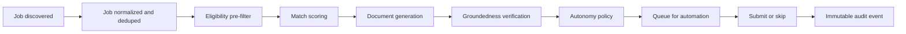

# Architecture

## Decision

Use a modular monolith for the product core and keep browser automation as the only separately deployable boundary.

The backend starts as one Spring Boot application with strict package boundaries:

```text
com.careercopilot
├── auth/
├── profile/
├── discovery/
├── matching/
├── generation/
├── automation/
├── applications/
├── notification/
└── shared/
```

Packages communicate through explicit DTOs and domain events. This keeps the first version shippable for a solo build while preserving a clean extraction path later.

## Automation Boundary

`automation/` is separate because browser automation has a different runtime and failure profile:

- Chromium memory and process management
- CAPTCHA and MFA interruptions
- Site-specific selector breakage
- Independent pause/resume behavior

The recommended connection is queue-based. The application core emits an automation command; the automation worker records screenshots, status, and platform responses back into the application audit log.

## Event Flow



## Core Rules

- Job descriptions are untrusted input.
- Generated resumes and cover letters may only select and reword verified profile facts.
- Groundedness failure blocks submission.
- Unsupported custom fields are skipped, not guessed.
- Per-platform caps and circuit breakers override match score.
- A kill switch must stop all future automation immediately.

## Initial Tech Choices

| Layer | Choice |
|---|---|
| Backend | Java LTS + Spring Boot modular monolith |
| Database | PostgreSQL with pgvector |
| Migrations | Flyway |
| Queue | Redis Streams first, RabbitMQ later if needed |
| Browser automation | Playwright |
| Testing | Unit tests, Testcontainers, WireMock, browser canaries, AI eval harness |
