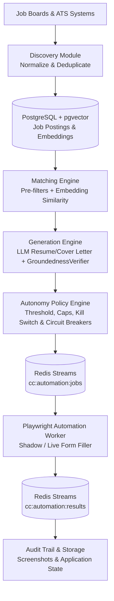
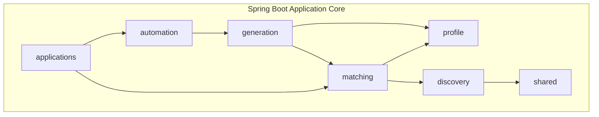

# System Architecture

Career Copilot is designed as a modular monolith application core paired with an isolated asynchronous browser automation worker. This architecture balances rapid developer iteration, strong domain boundaries, and process isolation for resource-intensive browser tasks.

## System Architecture Overview

## Modular Monolith Structure

The backend application runs as a single Spring Boot service with strict package boundaries. Each domain module encapsulates its internal logic and exposes explicit DTOs and domain events for inter-module communication.

### Module Responsibilities

| Module | Primary Responsibility | Key Interactions |
|---|---|---|
| `profile` | User Master Career Profile & Verified Facts | Queried by `matching` and `generation` |
| `discovery` | Ingests, normalizes, and deduplicates job postings | Stores jobs in PostgreSQL; uses `shared` |
| `matching` | Evaluates job fit using pre-filters & vector embeddings | Queries `profile` data and `discovery` jobs |
| `generation` | Generates tailored resumes & cover letters | Uses `profile` facts & `GroundednessVerifier` |
| `automation` | Manages job dispatching to automation queue | Consumes generated documents from `generation` |
| `applications` | Tracks application lifecycle & audit history | Coordinates with `automation` & `matching` |
| `shared` | Security (API key auth), LLM client interfaces, common DTOs | Imported by all feature modules |

## Automation Boundary

Browser automation is explicitly isolated into a separate TypeScript/Playwright service outside the main Spring Boot JVM process.

### Rationale for Process Isolation

- **Resource & Memory Management**: Headless Chromium browser instances consume significant CPU and RAM. Process isolation protects backend REST endpoints from browser memory spikes.
- **Fault Isolation**: DOM changes, anti-bot scripts, CAPTCHAs, or unexpected page crashes in Chromium are contained within the worker without destabilizing core API services.
- **Independent Scalability**: The Playwright automation worker can scale horizontally across container instances based on Redis stream queue depth.
- **Runtime Flexibility**: JavaScript/TypeScript provides native DOM manipulation capabilities and first-class integration with Playwright APIs.

The Spring Boot core and automation worker communicate asynchronously over Redis Streams (`cc:automation:jobs` for application payloads and `cc:automation:results` for status logs and screenshot artifacts).

## Safety Architecture

Safety and compliance govern every step of automated application execution through multiple defensive layers:

1. **Groundedness Verification**: The `GroundednessVerifier` evaluates all LLM-crafted text against verified user profile facts prior to queuing. Any detected hallucination or unverified claim triggers an immediate failure block.
2. **Platform Circuit Breakers**: Per-platform monitors track failure rates and selector breakages (e.g., on Greenhouse or Lever). If errors exceed configured thresholds, the circuit breaker opens, halting automated attempts on that ATS.
3. **Emergency Kill Switch**: A global kill switch (`POST /api/policy/pause`) instantly pauses all active and pending application jobs across all worker threads.
4. **Daily Caps & Rate Limits**: Strict daily application caps prevent aggressive job submission, preserving user domain reputation and avoiding anti-bot flags.
5. **Autonomy Tiers**:
   - **Manual Review**: Requires explicit user approval per application.
   - **Shadow Mode**: Worker navigates, pre-fills known fields, captures screenshots, and logs unhandled questions without submitting.
   - **Full Autonomy**: High-confidence applications (match score > 85%, 100% groundedness, 0 custom field errors) submit automatically.

## Tech Stack

| Domain | Technology | Notes |
|---|---|---|
| **Backend Core** | Java 21 / Spring Boot 3 | Modular monolith with package enforcement |
| **Database** | PostgreSQL 17 + pgvector | Relational database with vector search for job embeddings |
| **Schema Management** | Flyway | Declarative, version-controlled SQL migrations |
| **Event Transport** | Redis Streams | Asynchronous queue between backend core and workers |
| **Automation Worker**| Node.js / TypeScript / Playwright | Headless browser execution and DOM form filling |
| **Frontend** | Vanilla HTML5 / JavaScript / CSS3 | Zero-build dark mode productivity dashboard |
| **Testing Harness** | JUnit 5, Testcontainers, WireMock | Integration, database, and mock API testing |

## Core System Invariants

- **Untrusted External Data**: All job posting content and web page DOM structures are treated as untrusted input.
- **Strict Fact Verification**: Generated application materials may rephrase user experience but must never create unverified qualifications.
- **Groundedness Hard Stop**: Groundedness verification failures hard-block application queuing and submission.
- **Skip Unknown Custom Fields**: Unsupported custom questions or sensitive inputs are skipped and flagged rather than filled with speculative answers.
- **Policy Precedence**: Global kill switches, circuit breakers, and daily caps override high job match scores.
- **Immutable Audit Trail**: Every application attempt produces immutable event records accompanied by execution screenshots.
